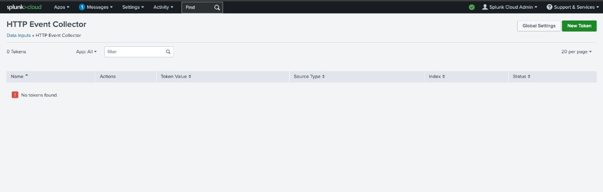
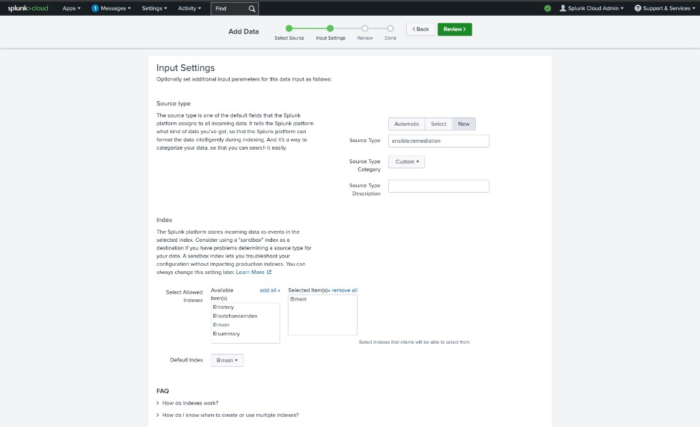
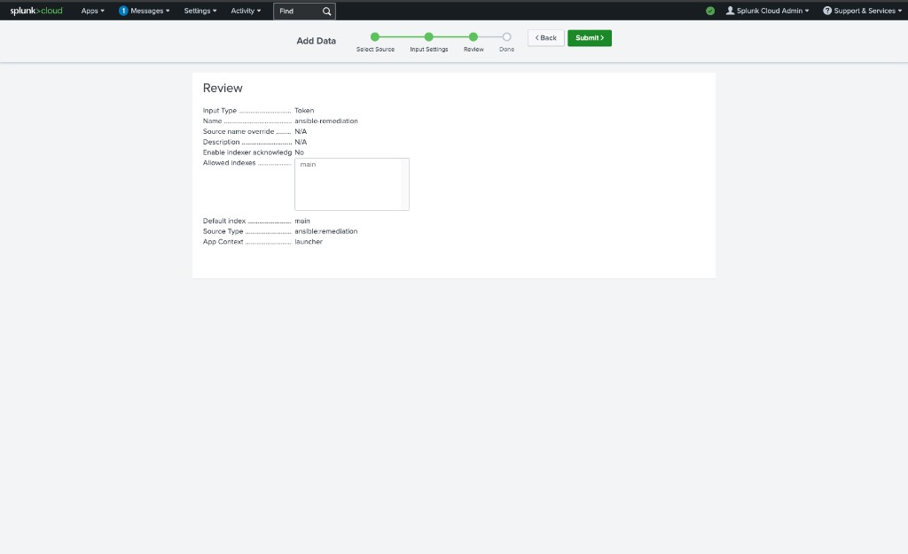
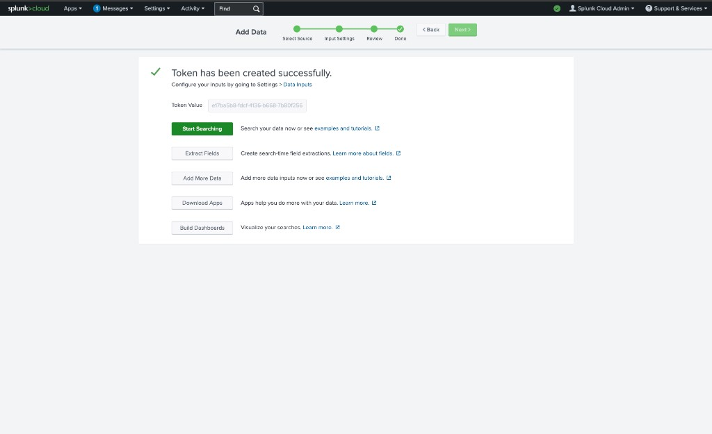

# Config Drift Remediation with Event-Driven Ansible

Closed-loop PoC: auditd detects a config change on a managed RHEL host → Splunk Cloud alert fires → webhook to EDA listener → EDA rulebook triggers AAP job template → idempotent remediation playbook restores desired state from Git → result reported back to Splunk via HEC.

## Architecture

```
RHEL host                    Splunk Cloud                AAP 2.5
─────────                    ────────────                ───────
auditd watches    ──▶  UF ships linux:audit  ──▶  Saved search
sshd_config, etc.      (TCP/443 outbound)         + Webhook alert
                                                        │
                                                        ▼ (HTTPS POST)
                                            EDA rulebook (webhook :5001)
                                            on public EC2 endpoint
                                                        │
                                                run_job_template
                                                        ▼
                                              Controller job:
                                              "Remediate Config Drift"
                                              (pulls desired state from Git)
                                                        │
                                                ┌───────┴───────┐
                                                ▼               ▼
                                          target host       Splunk HEC
                                          (idempotent       (close the loop)
                                          re-render)
```

## Repos

| Repo | Purpose |
|------|---------|
| **config-drift-eda** (this repo) | Demo plumbing — Terraform, auditd rules, EDA rulebook, bootstrap playbook, Splunk configs |
| **config-baseline** (separate repo) | Desired-state "catalog" — inventories, hardening roles, remediation playbooks, Jinja2 templates |

## Prerequisites

- AWS account with permissions to create EC2, SGs, EIPs, key pairs
- Splunk Cloud Platform trial (14-day, 5 GB/day) — **clock starts at registration**
- AAP 2.5 subscription or developer license (EDA controller + automation controller)
- Terraform >= 1.5

## Quick Start

### 1. Provision infrastructure

```bash
cd terraform
cp terraform.tfvars.example terraform.tfvars   # fill in your values
terraform init
terraform plan
terraform apply
```

All AWS resources are tagged `demo=config-drift` for easy teardown:

```bash
# find everything
aws ec2 describe-instances --filters "Name=tag:demo,Values=config-drift"

# nuke when done
terraform destroy
```

### 2. Bootstrap managed nodes

```bash
ansible-playbook playbooks/bootstrap_node.yml -i <inventory>
```

This installs:
- auditd rules (`/etc/audit/rules.d/50-drift.rules`)
- Splunk Universal Forwarder (configured to ship `linux:audit` logs)
- `log_format = ENRICHED` in auditd.conf for Splunk CIM uid→user resolution

### 3. Configure Splunk Cloud

#### 3a. Create an HEC token (close-the-loop reporting)

The remediation playbook posts results back to Splunk via HEC so you get both the drift event and the remediation event in one pane of glass.

1. Navigate to **Settings → Data Inputs → HTTP Event Collector**.



2. Click **New Token**. Name it `ansible-remediation`.

3. On the **Input Settings** screen, set:
   - **Source Type:** `ansible:remediation` (click **New**, type it in)
   - **Source Type Category:** `Custom`
   - **Default Index:** `main`



4. Review and **Submit**.



5. Copy the **Token Value** from the success screen.



6. The HEC endpoint URL follows the pattern `https://input-<your-stack>.splunkcloud.com:8088/services/collector/event`. Add both the token and URL to your `.env` file as `SPLUNK_HEC_TOKEN` and `SPLUNK_HEC_URL`.

#### 3b. Add EDA webhook to the allow-list

Settings → Server Settings → Webhook allow list → add your EDA endpoint URL (`https://<eda-host>:5001/endpoint`).

#### 3c. Create the saved search alert

Import the SPL from `splunk/saved_search.spl` as a real-time scheduled alert with a Webhook alert action pointing to `https://<eda-host>:5001/endpoint`. Throttle 5 min by host.

### 4. Activate EDA rulebook

In AAP EDA Controller, create a Rulebook Activation using `eda/rulebooks/config_drift.yml`. Ensure port 5001 is open inbound from Splunk Cloud egress IPs only (see `terraform/security_groups.tf`).

### 5. Create AAP job template

- **Name:** `Remediate SSH Config Drift`
- **Project:** synced to the `config-baseline` repo
- **Playbook:** `playbooks/remediate_ssh.yml`
- **Credentials:** machine credential for managed nodes
- **Extra vars:** `splunk_hec_url`, `splunk_hec_token` (store token in AAP credential or vault)

## Demo Script

1. Split-screen: terminal tailing `audit.log`, Splunk search, AAP Rulebook Activations.
2. SSH into managed node, `sudo vim /etc/ssh/sshd_config`, flip `PermitRootLogin no` → `yes`, save.
3. Audit log lights up — `key=ssh_config_change`, `auid` visible.
4. ~30s: Splunk saved search hits, alert fires webhook to EDA.
5. EDA rulebook matches, triggers `run_job_template` with `limit` scoped to the drifted host.
6. AAP job runs — facts gathered, Project sync pulls latest desired state from Git, template rendered, `sshd -t` validates.
7. `grep PermitRootLogin /etc/ssh/sshd_config` → back to `no`. `ls /etc/ssh/sshd_config.drift-*` shows forensics backup.
8. Splunk shows HEC remediation event — closed loop.
9. Re-run manually — zero changed tasks (idempotency).
10. **(Optional)** Push a broken template to Git → `validate: sshd -t` fails → sshd_config untouched, sshd keeps running. Risk-averse audience win.

## Design Constraints

- **Playbook is the source of truth.** EDA is one trigger among many — the playbook runs standalone or from EDA. Event metadata flows as extra_vars for logging, never for control flow.
- **`validate: '/usr/sbin/sshd -t -f %s'`** on the template task is non-negotiable.
- **Idempotent.** Second run with no drift = zero changed tasks.
- **EDA passes `limit`** so remediation touches only the drifted host (blast radius control).
- **`throttle: once_within: 2 minutes`** for event-storm protection (a single `vim` save fires multiple audit events).
- **Drifted file is backed up** before overwrite (`/etc/ssh/sshd_config.drift-<timestamp>`) for forensics.
- **Close the loop** — playbook posts result to Splunk HEC.

## Repo Layout

```
.
├── README.md
├── .env.example
├── ansible.cfg
├── ansible_deployment/              # AAP config-as-code
│   ├── cac/
│   │   ├── apply.yml                # infra.aap_configuration dispatch
│   │   └── vars.yml                 # all AAP/EDA objects
│   ├── eda/
│   │   ├── webhook-de.yml           # decision environment definition
│   │   └── context/                 # DE container build context
│   └── scripts/
│       └── cac-apply.sh             # one-shot apply from .env
├── config-baseline/                 # desired-state "catalog"
│   ├── inventories/prod/
│   ├── roles/ssh_hardening/
│   ├── playbooks/remediate_ssh.yml
│   └── requirements.yml
├── terraform/
│   ├── main.tf
│   ├── variables.tf
│   ├── outputs.tf
│   ├── ec2.tf
│   └── security_groups.tf
├── auditd/
│   └── 50-drift.rules
├── docs/images/                     # setup guide screenshots
├── eda/
│   └── rulebooks/
│       └── config_drift.yml
├── playbooks/
│   └── bootstrap_node.yml
└── splunk/
    ├── inputs.conf.sample
    └── saved_search.spl
```

## AWS Tagging

Every resource carries `demo=config-drift`. Terraform's `default_tags` propagates this automatically. For any manual CLI provisioning, include `--tag-specifications 'ResourceType=instance,Tags=[{Key=demo,Value=config-drift}]'`.
