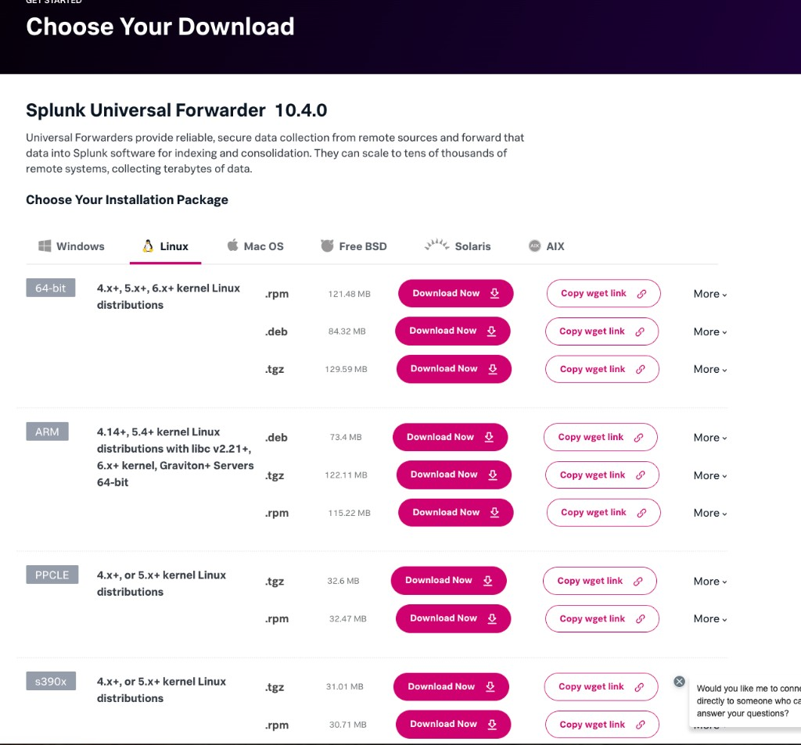
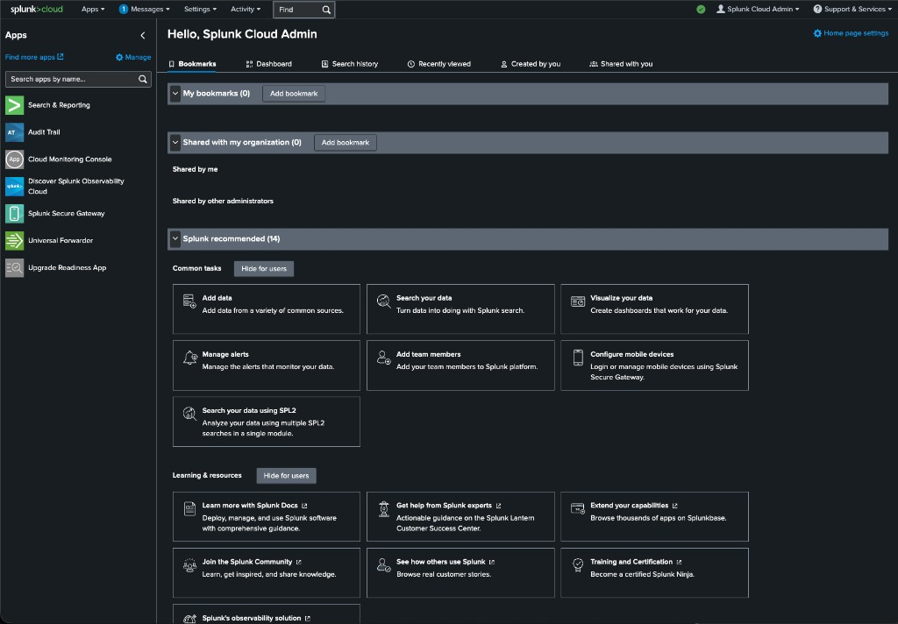
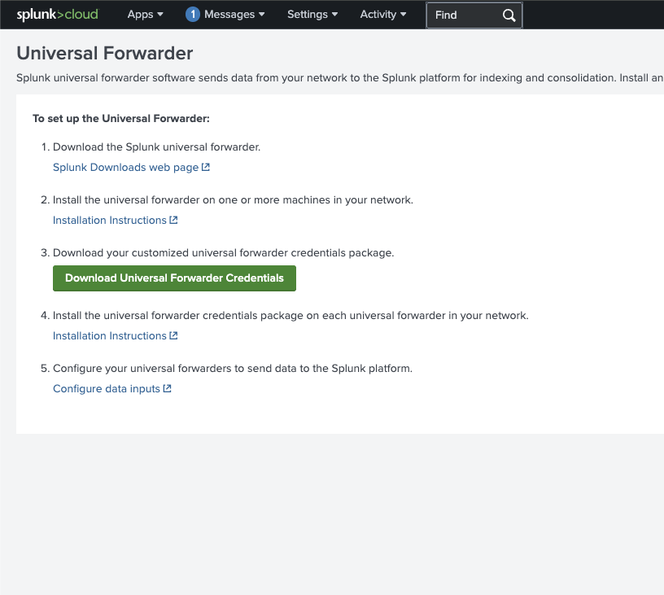
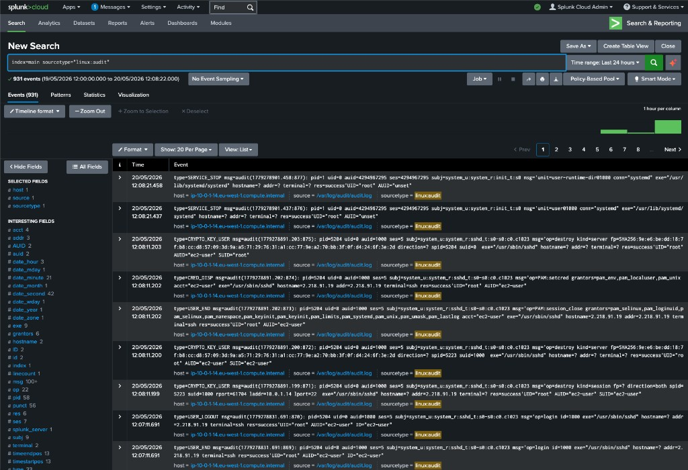
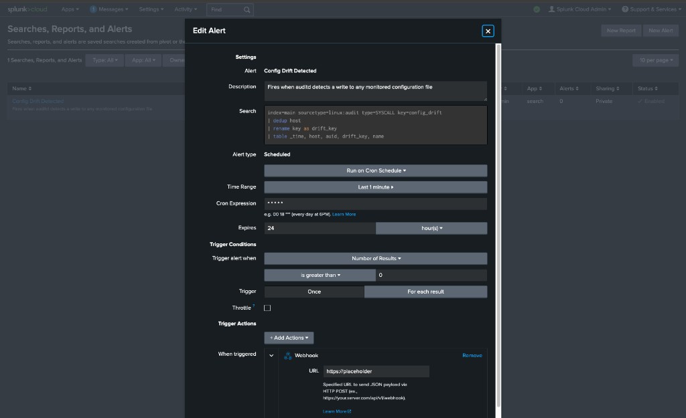

# Config Drift Remediation with Event-Driven Ansible

Closed-loop PoC: auditd detects a config change on a managed RHEL host → Splunk Cloud alert fires → webhook to EDA listener → EDA rulebook triggers AAP job template → idempotent remediation playbook restores desired state from Git → result reported back to Splunk via HEC.

## Architecture

```
RHEL host                    Splunk Cloud                AAP 2.5
─────────                    ────────────                ───────
auditd watches    ──▶  UF ships linux:audit  ──▶  Saved search
sshd_config, etc.      (TCP/443 outbound)         + Webhook alert
                                                        │
                                                        ▼ (HTTPS POST)
                                            EDA rulebook (webhook :5001)
                                            on public EC2 endpoint
                                                        │
                                                run_job_template
                                                        ▼
                                              Controller job:
                                              "Remediate Config Drift"
                                              (pulls desired state from Git)
                                                        │
                                                ┌───────┴───────┐
                                                ▼               ▼
                                          target host       Splunk HEC
                                          (idempotent       (close the loop)
                                          re-render)
```

## Repos

| Repo | Purpose |
|------|---------|
| **config-drift-eda** (this repo) | Everything — Terraform, auditd rules, EDA rulebook, bootstrap playbook, Splunk configs, AAP CaC, and the desired-state baseline |
| **config-baseline/** (subdirectory) | Desired-state "catalog" — inventories, hardening roles, remediation playbooks, Jinja2 templates |

## Prerequisites

- AWS account with permissions to create EC2, SGs, EIPs, key pairs
- Splunk Cloud Platform trial (14-day, 5 GB/day) — **clock starts at registration**
- AAP 2.5 subscription or developer license (EDA controller + automation controller)
- Terraform >= 1.5

## Quick Start

### 1. Provision infrastructure

```bash
cd terraform
cp terraform.tfvars.example terraform.tfvars   # fill in your values
terraform init
terraform plan
terraform apply
```

All AWS resources are tagged `demo=config-drift` for easy teardown:

```bash
# find everything
aws ec2 describe-instances --filters "Name=tag:demo,Values=config-drift"

# nuke when done
terraform destroy
```

### 2. Bootstrap managed nodes

This installs chronyd (time sync), auditd rules, and the Splunk Universal Forwarder.

Before running, download two files into the `splunk_packages/` directory (gitignored):

#### 2a. Splunk Universal Forwarder RPM

1. Go to [Splunk Universal Forwarder Downloads](https://www.splunk.com/en_us/download/universal-forwarder.html) (requires a free Splunk login).
2. Select **Linux** → **64-bit** → **.rpm** (the managed EC2 instance is x86_64, not ARM).
3. Click **"Download Now"** and save the file as `splunk_packages/splunkforwarder.rpm`.



#### 2b. Splunk Cloud credentials package

1. In Splunk Cloud, click **Apps** in the top menu and select **Universal Forwarder** from the sidebar.



2. Click the green **"Download Universal Forwarder Credentials"** button.



3. Save the downloaded `.spl` file as `splunk_packages/splunkclouduf.spl`.

This package authenticates the UF with your Splunk Cloud indexers. It's stack-specific so it cannot be committed to Git.

#### 2c. Run the bootstrap

```bash
./scripts/bootstrap.sh
```

The script loads `.env` automatically, then runs the bootstrap playbook which copies both packages to the managed node, installs them, configures auditd with `config_drift` watch rules, and starts forwarding `linux:audit` logs to Splunk Cloud.

#### 2d. Verify events are flowing

After the bootstrap completes, wait a minute then search in Splunk Cloud:

```spl
index=main sourcetype=linux:audit
```

You should see auditd events appearing:



> **Note:** You'll likely see hundreds of events immediately. This is normal — when the Universal Forwarder starts monitoring `/var/log/audit/audit.log`, it reads the **entire existing file** from the beginning, not just new events. All historical auditd activity since the instance was launched gets shipped in one batch. After this initial backlog, the flow settles to a trickle of a few events per minute.

### 3. Configure Splunk Cloud

#### 3a. Create an HEC token (close-the-loop reporting)

The remediation playbook posts results back to Splunk via HEC so you get both the drift event and the remediation event in one pane of glass.

1. Navigate to **Settings → Data Inputs → HTTP Event Collector**.


2. Click **New Token**. Name it `ansible-remediation`.

3. On the **Input Settings** screen, set:
   - **Source Type:** `ansible:remediation` (click **New**, type it in)
   - **Source Type Category:** `Custom`
   - **Default Index:** `main`


4. Review and **Submit**.


5. Copy the **Token Value** from the success screen.


6. The HEC endpoint URL follows the pattern `https://input-<your-stack>.splunkcloud.com:8088/services/collector/event`. Add both the token and URL to your `.env` file as `SPLUNK_HEC_TOKEN` and `SPLUNK_HEC_URL`.

#### 3b. Add EDA webhook to the allow-list

1. Navigate to **Settings → Server Settings → Webhook allow list**.
2. Add your EDA endpoint URL: `https://<aap-eda-host>/endpoint` (the EDA controller on your AAP instance).
3. Save.

Without this, Splunk Cloud will refuse to fire webhooks to your EDA listener.

#### 3c. Create the saved search alert

1. Navigate to **Settings → Searches, reports, and alerts → New Alert**.
2. Fill in the fields as shown below:

   - **Title:** `Config Drift Detected`
   - **Description:** `Fires when auditd detects a write to any monitored configuration file`
   - **Search:**
     ```spl
     index=main sourcetype=linux:audit type=SYSCALL key=config_drift
     | dedup host
     | rename key as drift_key
     | table _time, host, auid, drift_key, name
     ```
   - **Alert type:** Scheduled → **Run on Cron Schedule** → `* * * * *`
   - **Time Range:** **Last 1 minute** (Earliest: `-1m@m`, Latest: `now`). Do **not** use "All time" — otherwise the alert re-fires on the same event every minute and creates an event storm.
   - **Trigger alert when:** Number of Results is greater than 0
   - **Trigger:** For each result
   - **Trigger Actions:** Webhook (leave URL blank for now — set it after AAP `cac-apply.sh` creates the Event Stream)



3. Save.

#### 3d. Create a `linux` index (if not using `main`)

If you want audit logs in a dedicated index: **Settings → Indexes → New Index → `linux`**. Then update the saved search to use `index=linux`.

### 4. Configure AAP (config-as-code)

All AAP objects (org, credentials, projects, job templates, workflow, EDA rulebook activation) are defined in `ansible_deployment/cac/vars.yml` and applied in one shot:

```bash
./ansible_deployment/scripts/cac-apply.sh
```

This creates:
- **Organization:** `config-drift-demo` with `demo_config_drift_admin` user
- **Workflow:** "Remediate SSH Config Drift" (Create SNOW incident → Remediate → Resolve SNOW incident)
- **EDA Rulebook Activation:** webhook listener on port 5001
- **Credentials:** Machine SSH, Splunk HEC, ServiceNow, AAP Controller token

## Demo Script

1. Split-screen: terminal tailing `audit.log`, Splunk search, AAP Rulebook Activations.
2. SSH into managed node, `sudo vim /etc/ssh/sshd_config`, flip `PermitRootLogin no` → `yes`, save.
3. Audit log lights up — `key=ssh_config_change`, `auid` visible.
4. ~30s: Splunk saved search hits, alert fires webhook to EDA.
5. EDA rulebook matches, triggers `run_job_template` with `limit` scoped to the drifted host.
6. AAP job runs — facts gathered, Project sync pulls latest desired state from Git, template rendered, `sshd -t` validates.
7. `grep PermitRootLogin /etc/ssh/sshd_config` → back to `no`. `ls /etc/ssh/sshd_config.drift-*` shows forensics backup.
8. Splunk shows HEC remediation event — closed loop.
9. Re-run manually — zero changed tasks (idempotency).
10. **(Optional)** Push a broken template to Git → `validate: sshd -t` fails → sshd_config untouched, sshd keeps running. Risk-averse audience win.

## Design Constraints

- **Playbook is the source of truth.** EDA is one trigger among many — the playbook runs standalone or from EDA. Event metadata flows as extra_vars for logging, never for control flow.
- **`validate: '/usr/sbin/sshd -t -f %s'`** on the template task is non-negotiable.
- **Idempotent.** Second run with no drift = zero changed tasks.
- **EDA passes `limit`** so remediation touches only the drifted host (blast radius control).
- **`throttle: once_within: 2 minutes`** for event-storm protection (a single `vim` save fires multiple audit events).
- **Drifted file is backed up** before overwrite (`/etc/ssh/sshd_config.drift-<timestamp>`) for forensics.
- **Close the loop** — playbook posts result to Splunk HEC.

## Repo Layout

```
.
├── README.md
├── .env.example
├── ansible.cfg
├── ansible_deployment/              # AAP config-as-code
│   ├── cac/
│   │   ├── apply.yml                # infra.aap_configuration dispatch
│   │   └── vars.yml                 # all AAP/EDA objects
│   ├── eda/
│   │   ├── webhook-de.yml           # decision environment definition
│   │   └── context/                 # DE container build context
│   └── scripts/
│       └── cac-apply.sh             # one-shot apply from .env
├── config-baseline/                 # desired-state "catalog"
│   ├── inventories/prod/
│   ├── roles/ssh_hardening/
│   ├── playbooks/remediate_ssh.yml
│   └── requirements.yml
├── terraform/
│   ├── main.tf
│   ├── variables.tf
│   ├── outputs.tf
│   ├── ec2.tf
│   └── security_groups.tf
├── auditd/
│   └── 50-drift.rules
├── docs/images/                     # setup guide screenshots
├── eda/
│   └── rulebooks/
│       └── config_drift.yml
├── playbooks/
│   └── bootstrap_node.yml
└── splunk/
    ├── inputs.conf.sample
    └── saved_search.spl
```

## AWS Tagging

Every resource carries `demo=config-drift`. Terraform's `default_tags` propagates this automatically. For any manual CLI provisioning, include `--tag-specifications 'ResourceType=instance,Tags=[{Key=demo,Value=config-drift}]'`.
